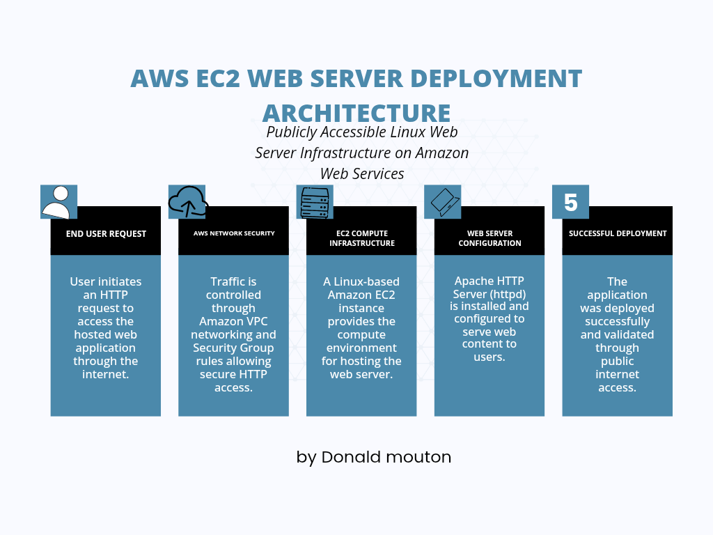
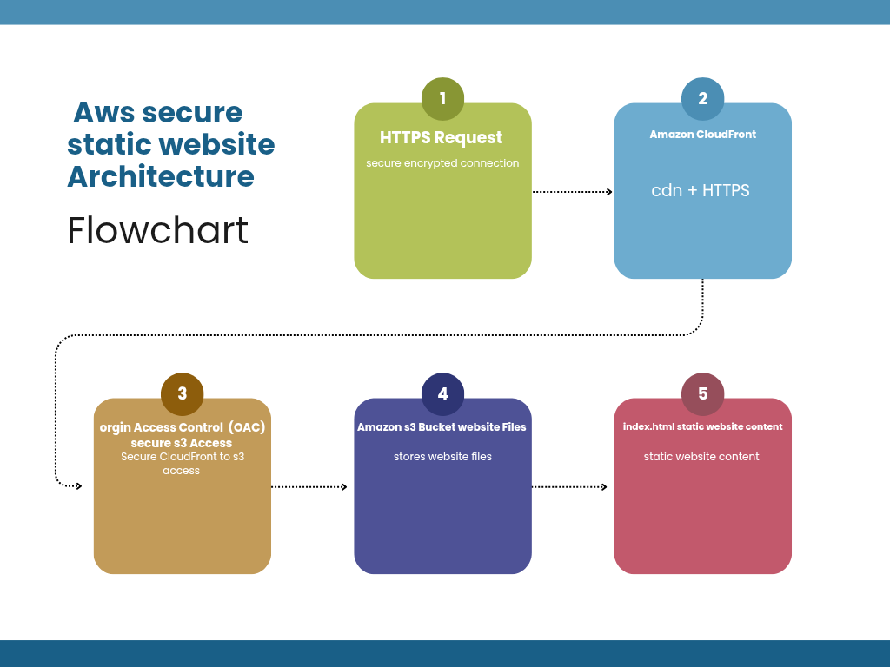

# AWS Secure Static Website Infrastructure
## Live Website

https://drgljsz62xn3q.cloudfront.net
## Overview
Deployed a secure static website using Amazon S3 and Amazon CloudFront with HTTPS delivery.

## AWS Services Used
- Amazon S3 - Website storage
- Amazon CloudFront - CDN and HTTPS delivery
- Origin Access Control (OAC) - Secure S3 access
- IAM/S3 Bucket Policies - Permissions and security

## Project Highlights
- Built and deployed a static website architecture
- Configured CloudFront distribution with HTTPS
- Secured S3 access using Origin Access Control (OAC)
- Troubleshot AWS permissions and caching issues
## Architecture Diagram

## Project Screenshots

### Amazon S3 Configuration
- S3 Bucket Overview
- S3 Website Deployment
- S3 Bucket Policy
- S3 ACL Configuration

### Amazon CloudFront Configuration
- CloudFront Distribution
- CloudFront Origin Configuration
- CloudFront Behaviors
- CloudFront Default Root Object
- CloudFront Cache Invalidation

### Website Deployment
- Static Website Deployment
- ## Architecture Diagram

## Project 1: Secure Static Website Infrastructure Deployment

### Overview
Deployed a secure static website using AWS cloud services.

### AWS Services Used
- Amazon S3
- Amazon CloudFront
- IAM
- S3 Bucket Policies

---

## Project 2: EC2 Web Server Deployment

### Overview
Deployed and configured an Apache web server on an Amazon EC2 instance. Configured network access using AWS security groups and verified public web access.

# AWS Cloud Portfolio

### AWS Services Used
- Amazon EC2
- Amazon VPC
- Security Groups
- IAM

### Live Demo
http://52.14.59.23

### Architecture
User → EC2 Instance → Apache Web Server
